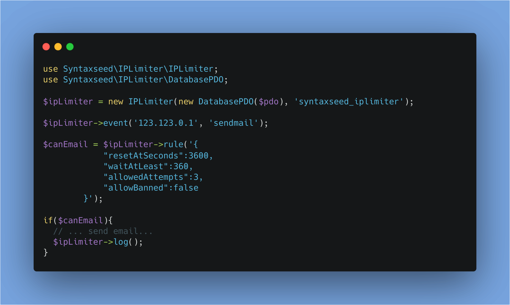

IPLimiter
=========================

<div align="center">
    &nbsp;&nbsp;
    &nbsp;&nbsp;
    &nbsp;&nbsp;
    &nbsp;&nbsp;
    <br>
    <a href="https://phpc.social/@syntaxseed">
        </a>&nbsp;&nbsp;<a href="https://github.com/syntaxseed#donatecontribute"></a>
</div>

A lightweight, framework agnostic, PHP IP address logging library for tracking the # of attempts, and time of last attempt for various categories of events. An event is an IP address and category string combo. The library includes helpers for setting/getting ban status, deleting individual events or all events for a given IP, etc.

Common uses include creating a tarpit or code-level gates/limits for any attempted action in your application.



The IPLimiter constructor must be passed a connected PDO object to create a database table and log the events.

The core function of the library is to execute a set of 'rules' which IPLimiter will then determine whether the IP address passes or fails the ruleset, and therefore whether they should be allowed to proceed. Rules can specifiy a max # of attempts, and how long it must be before the next attempt. And whether ban status matters for this rule. An example will follow.

Licence: MIT.

Author: Sherri Wheeler.

Current Version: 2.0.4.


Features
--------

* Compliant with IPv4 and IPv6 addresses.
* Simple to learn and use.
* Track and run rules against:
  * Number of attempts.
  * Time since last attempt.
  * Ban status.
* Reset # attempts after a given time has passed.
* Flexible. IP Addresses and event strings can be anything.
* Unit-Testing with PHPUnit.
* Compliant with PHP  8.0+, 8.1+, 8.2+, 8.3+.


Installation
--------

Require with Composer:
```
composer require syntaxseed/iplimiter ^2.0
```
> **Major version 2 is not compatible with version 1.**

Usage - Quick Start
--------

First ensure you have a connected PDO object. (http://php.net/manual/en/book.pdo.php). Or implement a new class which implements the included `DatabaseInterface`. An implementation of a class for PDO connections is included (`DatabasePDO`).

Import the namespaces into your application:
```php
use Syntaxseed\IPLimiter\IPLimiter;
use Syntaxseed\IPLimiter\DatabasePDO;
```

Initialize a PDO object and use it to create a new IPLimiter instance. The second parameter is your desired database table name for IPLimiter to use. There is a `DatabasePDO` class included which implements the `DatabaseInterface` required by IPLimiter.
```php
$ipLimiter = new IPLimiter(new DatabasePDO($pdo), 'syntaxseed_iplimiter');
```

If you aren't using PDO, you can implement a DB wrapper class which implements the 'Syntaxseed\IPLimiter\DatabaseInterface.

**Create the IPLimiter table if it doesn't already exist:**

This and future functions will use the DatabaseInterface object injected via the constructor.
```php
$result = $ipLimiter->migrate();
```

> **Only run this ONCE. It will create the initial tables for you.**

**Log a new event.**

An event has an IP address and a string 'category'. Working with events requires an event to have been set.
```php
$ipLimiter->event('123.123.0.1', 'sendmail');
$ipLimiter->log();
```

Or, you can method chain the initialization of the object, setting of event, and logging:
```php
$ipLimiter = (new IPLimiter(new DatabasePDO($pdo), 'syntaxseed_iplimiter'))
            ->event('123.123.0.1', 'sendmail')
            ->log();
```

**Get whether an event exists in the dabase.**
```php
$ipLimiter->event('111.111.111.111', 'sendmail');
$isLogged = $ipLimiter->exists();
    // $isLogged is false.
$ipLimiter->log();
$isLogged = $ipLimiter->exists();
    // $isLogged is true.
```

**Get or reset the # of attemps for a given event.**
```php
$ipLimiter->event('123.123.0.1', 'sendmail');
$ipLimiter->log();
$ipLimiter->log();
$attempts = $ipLimiter->attempts();
    // Returns 2.
$ipLimiter->resetAttempts();
    // Sets value to 0.
```

**Get or reset the time since last attempt.**
```php
$ipLimiter->event('123.123.0.1', 'sendmail');
$ipLimiter->log();
$lastTime = $ipLimiter->last(false);
    // Returns the unix epoc time since last attempt.
$lastSeconds = $ipLimiter->last();
    // Returns the # of seconds since last attempt.
```
Note: You cannot rest the time since last attempt. If there is a record in the database for this event, then it has a timestamp. To solve this, just delete the event completely, which equates to 'never'.

**Delete an event.**
```php
$ipLimiter->event('123.123.0.1', 'sendmail');
$ipLimiter->log();
$ipLimiter->deleteEvent();
```

**Delete ALL events for a given IP.**

This function does NOT require an event to be set, instead, pass in the IP address.
```php
$result = $ipLimiter->deleteIP('123.123.0.1');
// Returns false if no records were found/deleted. True otherwise.
```

**Manage ban status for an event.**

 Note that with this method, an IP is banned from individual categories of events, not banned system-wide. The ban/unBan methods return the current ban status, NOT whether the ban/unban set succeeded or not.
```php
$ipLimiter->event('123.123.0.1', 'sendmail');
$ipLimiter->log();
$status = $ipLimiter->isBanned();
    // Returns false, ie not currently banned.
$status = $ipLimiter->ban();
    // Now true, ie is currently banned.
$status = $ipLimiter->unBan();
    // Now false, ie not currently banned.
```


Rules
--------

A core feature of IPLimiter is running an event against a ruleset to see if it passes. In this way your application can have different rules for various categories of actions. Here's an example:

**Rule Example: Sending Mail**

In our application, users can only send mail at most every 5 minutes (300 seconds). They can make at most 3 attempts at sending mail before the reset time. Ban status matters for this ruleset (ie some events might use ban status for other purposes but not for rules). Attempts get reset after an hour of no attempts (3600 seconds).

Our ruleset in JSON format:
```php
{
    "resetAtSeconds": 3600,
    "waitAtLeast": 300,
    "allowedAttempts": 3,
    "allowBanned":false
}
```
This means:
- If a record doesn't exist in the database, PASS.
- If last attempt was at or older than (>=) 3600 seconds ago, reset attempts to 0.
- If last attempt was more recent than (<) 300 seconds ago, FAIL.
- If current attempts is more than (>) 3, FAIL.
- If banned, FAIL.
- Otherwise, PASS.

Execute the ruleset for the currently set event (will fail):
```php
$ipLimiter->event('111.222.333.444', 'sendmail');
$ipLimiter->log(); // User sent first mail.
$ruleResult = $ipLimiter->rule('{
            "resetAtSeconds":3600,
            "waitAtLeast":300,
            "allowedAttempts":3,
            "allowBanned":false
        }');

// $ruleResult is false because there was NO time since the last (log) event.
```

Execute a ruleset for the currently set event (will pass):
```php
$ipLimiter->event('111.222.333.444', 'sendmail');
$ipLimiter->log(); // User sent first mail.
$ruleResult = $ipLimiter->rule('{
            "resetAtSeconds":3600,
            "waitAtLeast":-1,
            "allowedAttempts":3,
            "allowBanned":false
        }');

// $ruleResult is true because -1 means ignore time since last event, and only look at attempts. 1 <= 3 so PASS.
```

**TIP:** Parts of the ruleset "resetAtSeconds", "waitAtLeast", and "allowedAttempts"  can be set to -1 to ignore this part.


Contributing
--------
* Pull requests are welcome and appreciated! Please be patient while I find time to review.
* Donations: https://github.com/syntaxseed#donatecontribute


Changelog
--------
* v2.0.4 - Tested & updated for PHP 8.2 & 8.3.
* v2.0.3 - Tested for PHP 8.1.
* v2.0.2 - Tested for PHP 8.0, fix PSR formatting.
* v2.0.0 - IPLimiter now expects a database object which implments the included DatabaseInterface. A PDO implementation of this is included. NOTE: Not compatible with version 1 due to database column type change.
* v1.0.4 - Add screenshot to readme.
* v1.0.3 - Allow method chaining on the event() and log() methods.
* v1.0.2 - Improve readme. Better package description.
* v1.0.1 - Fix readme.
* v1.0.0 - Initial release.
